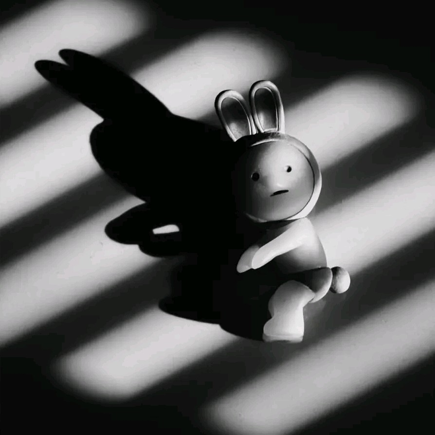

<!DOCTYPE html>
<html lang="id">

<head>
    <meta charset="UTF-8">
    <meta name="viewport" content="width=device-width, initial-scale=1.0">

    <title>BEAT RUSH</title>

    <link rel="stylesheet" href="beatrush.css">
</head>

<body>

    <!-- VIDEO BACKGROUND --> 
     <video id="bg-video" autoplay muted loop playsinline> 
        <source src="what/ssstik.io_1789540318451.mp4" type="video/mp4"> </video>
    
    

        

        <h1>BEAT RUSH</h1>

        <h3>PESAN TERAKHIR DARI SAYA</h3>

        

            SBELUMNYA AKU MAU BILANG TERIMA KASIH BANYAK KE KAMU YANG PERNAH MENJADI CINTAKU YANG PERTAMA SEBENARNYA AKU MASIH SAYANG KEPADAMU TAPI TAKDIR BERKATA KITA HARUS MENJAUH KITA PISAH DENGAN KEADAAN BAIK BAIK DAN SATU AKU MAU BILANG JANGAN PERNAH TINGGALKAN KEWAJIBANMU
            DAN PATUHI APA KATA ORANG TUA MU (AKU MOHON JANGAN PERNAH DATANG LAGI DI HIDUPKU ATAU MENANYAKAN KABARKU SEMOGA KAMU BAHAGIA DENGAN PASANGANMU YANG BARU)
        

        <h5>
            DARAH DIBALAS DENGAN DARAH LUKA DIBALAS DENGAN LUKA
        </h5>

    

      WHAT SECURITY ID : MY CHAIRMAN "BEAT RUSH" SDWV - ID JAWA - YOUQ KALTIM - DINOX94 - CREW MALAY - JKTXPLOIT - PALEMBANG666 - COOL TEAM BLACK HAT - CIPTO PRANCIS - WHERE XPLOIT - TECHLA BLACK HAT - PAPUA XPLOIT - INDO40134 - HACKEDSCC - PEKANBARU TEAM - GARUDA TEAM BLACK HAT - SURABAYA XPLOIT "TEAM WHAT SECURITY ID"
    

        <audio id="audio" controls autoplay>
            <source
                src="what/19 lagu di gabung.mp3"
                type="audio/mpeg">
        </audio>

    

    

</body>

</html>
